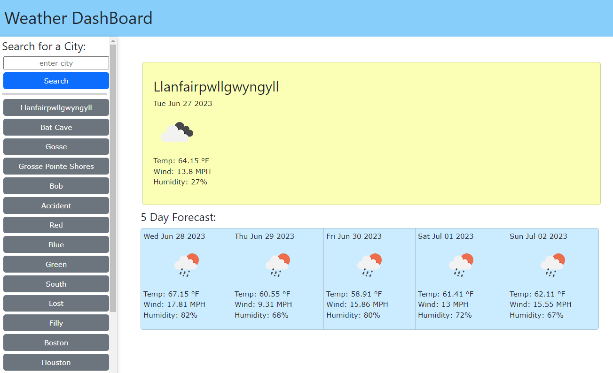
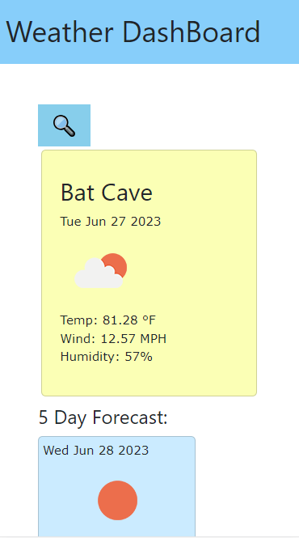

# Weather-Dashboard
 
## Description

A simple weather dashboard. The can search a city and it will show the current weather of the location on the main card and the next 5 days below. The information they will show is the city name, date, an icon of the weather condition, temparature in farenheit, wind speed in MPH, and the percentage of humidity.
If the user hovers over (or held on mobile devices) the icon the description of the weather will be shown.

Code is written in JavaScript, HTML, and CSS.

## Features

When entering a city, if the location was valid the city will be added to a history list within the sidebar. This history will be saved in localStorage. If the user chooses a previous entered city it will move to the top of the list. If the city was invalid or the search field was empty, there will be a small message above the main card telling the user that the city could not be found.

Thte side bar is responsive. On screen sizes that are less than 992 pixels in width, the sidebar will not show on default. To access the sidebar the user has to click the magnifying glass icon. The sidebar can be closed with the close button on the top. If valid a city was entered the sidebar will automattically close so the user can instanlty see the results.

The weather api can also accept countries and will show the user the data from the middle of the country.

## Credits

Weather API: https://openweathermap.org/api

CSS framework for the buttons and the cards: https://getbootstrap.com/

CSS framework for the sidebar: https://www.w3schools.com/w3css/ (* it includes small snipets of js code too)

Javascript: https://api.jquery.com/

## License

Please refer to the LICENSE in the repo.

## Link/Screentshot

https://cymcolor.github.io/Weather-Dashboard/

Large screen version

Small screen version

